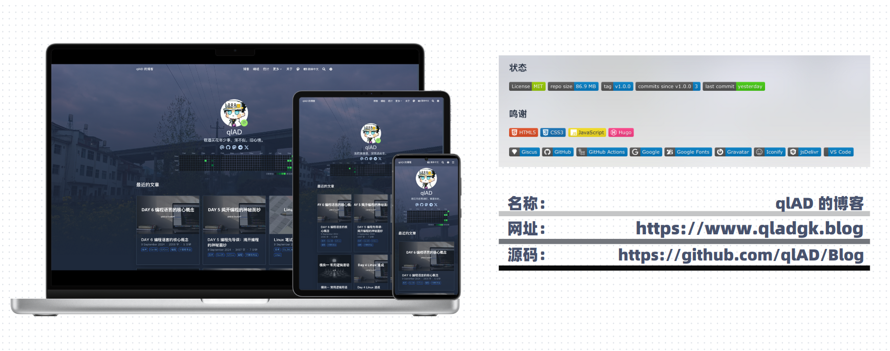

> 博客中大部分页面模板来自 [大大的小蜗牛](https://www.eallion.com/) 的博客。可以去原作者的 [仓库](https://github.com/eallion/eallion.com) 学习更多。

    

##### 本仓库用于存放个人博客的源代码，主要用于记录学习笔记、生活感悟、生活收获等内容。不定时更新，欢迎关注。每月 30 日自动将 content/blog 目录下的所有文章备份成 GitHub Release。

---

#### 📖 博客介绍：

- 博客地址：[https://www.qladgk.blog](https://www.qladgk.blog)
- 博客引擎：[Hugo](https://gohugo.io/)
- 博客主题：[Blowfish](https://blowfish.page/)

#### 🚀 托管部署：

- 博客仓库：[https://github.com/qlAD/Blog](https://github.com/qlAD/Blog)
- 博客部署:

  通过 GitHub Actions 自动部署到 Cloudflare Pages 和 GitHub Pages。然后通过自定义规则进行重定向。

  - Cloudflare Pages: [https://www.qladgk.blog](https://www.qladgk.blog)
  - Github Pages: [https://cn.qladgk.blog](https://cn.qladgk.blog)

#### 📦 迁移备份：

- 迁移仓库：

```sh
# 安装依赖
sudo pacman -S hugo pnpm
# 克隆仓库及子模块
git clone --recurse-submodules https://github.com/qlAD/Blog BlogGithub/ && cd BlogGithub/
# 本地服务器启动
pnpm install && pnpm run server
```

- 备份文章：GitHub Actions 自动备份 `content/blog` 目录下的所有文章到 Release。

```bash
https://github.com/qlAD/Blog/blob/main/.github/workflows/monthly-blog-backup.yml
```

```md
### 📅 ${{ env.RELEASE_DATE }} 博客文章备份

- **中文文章**: ${{ env.CHINESE_POST_COUNT }} 篇
- **英文文章**: ${{ env.ENGLISH_POST_COUNT }} 篇
- **图片**: ${{ env.IMAGE_COUNT }} 张
- **压缩包大小**: ${{ env.ZIP_SIZE }} MB

> 此备份包括所有博客文章和图片的压缩包文件，可用于恢复和迁移。
```

#### 🔨 调试部署：

- `pnpm run dev` 监听 Tailwind CSS 样式：
- `pnpm run server` 启动本地服务器：
- `pnpm run build` 构建 Tailwind CSS 样式，位于 `assets/css/compiled/main.css`：
- `pnpm run submodule` 更新 git submodule：
- `git push origin main` 部署博客（推送到 GitHub 仓库即可）：

```json
"scripts": {
   "server": "hugo server -b http://localhost -p 8000",
   "submodule": "git submodule update --remote --merge",
   "dev": "NODE_ENV=development ./themes/blowfish/node_modules/tailwindcss/lib/cli.js -c ./themes/blowfish/tailwind.config.js -i ./themes/blowfish/assets/css/main.css -o ./assets/css/compiled/main.css --jit -w",
   "build": "NODE_ENV=production ./themes/blowfish/node_modules/tailwindcss/lib/cli.js -c ./themes/blowfish/tailwind.config.js -i ./themes/blowfish/assets/css/main.css -o ./assets/css/compiled/main.css --jit"
}
```

#### 📁 博客结构：

- `assets`：存放博客的 CSS、JS、图片等静态资源
- `config`：博客配置文件
- `content`：博客文章存放目录
- `data`：存放数据信息
- `i18n`：存放多语言文件
- `layouts`：博客布局目录
- `scripts`：存放脚本文件
- `static`：存放静态文件
- `themes`：博客主题目录

```
.
├── .github
│   └── workflows
|       └── deploy.yml
├── assets
│   ├── css
│   └── ...
├── config
|   └── _default
│       └── hugo.toml
├── content
│   └── blog
├── data
│   └── authors
├── i18n
│   └── zh-CN.toml
├── layouts
│   ├── _default
│   └── partials
├── scripts
│   └── submit_urls.sh
├── static
│   └── assets
└── themes
    └── blowfish
```

#### 🎨 博客主题：

- [Blowfish](https://blowfish.page/)：一款简洁、清新、响应式的 Hugo 主题

- 自定义 CSS 在 `assets/css/` [https://github.com/qlAD/Blog/blob/main/assets/css/custom.css](https://github.com/qlAD/Blog/blob/main/assets/css/custom.css)：

```bash
https://github.com/qlAD/Blog/blob/main/assets/css/custom.css
```

- 自定义 JS 在 `assets/js/`： [https://github.com/qlAD/Blog/blob/main/assets/js/pangu.custom.js](https://github.com/qlAD/Blog/blob/main/assets/js/pangu.custom.js)：
  
```bash
https://github.com/qlAD/Blog/blob/main/assets/js/pangu.custom.js
```

- 自定义模板在 `layouts/_default`： [https://github.com/qlAD/Blog/blob/main/layouts/_default/mastodon.html](https://github.com/qlAD/Blog/blob/main/layouts/_default/mastodon.html)：

```bash
https://github.com/qlAD/Blog/blob/main/layouts/_default/mastodon.html
```

- 页面数据在 `data`： [https://github.com/qlAD/Blog/blob/main/data/authors/qlAD.json](https://github.com/qlAD/Blog/blob/main/data/authors/qlAD.json)：

```bash
https://github.com/qlAD/Blog/blob/main/data/authors/qlAD.json
```

#### 🎈 嘀咕页面

嘀咕页面 https://www.qladgk.blog/mastodon 为 Mastodon 大型实例 mastodon.social 的数据展示。

利用 [mastodon-embed-timeline](https://gitlab.com/idotj/mastodon-embed-timeline) 这个项目集成到博客页面。

#### 📝 撰写文章

- 文章存放在 `content/blog` 目录下，每篇文件存放在一个文件夹中，文件夹名称为文章的 URL。
- 文件夹中必须包含 `index.md` 文件，该文件为文章的 Markdown 内容。
- `index.md` 文件的 Front Matter 示例：

```yaml
---
title: "我的家乡"
authors: ["qlAD"]
categories: ["日常"]
tags: ["家乡", "风景"]
slug: "my-home"
summary: "本篇文章介绍了我的家乡，以及我在那里的生活。"
series: ["家乡回忆"]
series_weight: 1
seriesNavigation: true
draft: false
date: 2024-05-31
---
```

- 文章的封面图片为 `index.md` 文件同级目录的 `featured.jpg` 文件。
-  文章的背景图片为 `index.md` 文件同级目录的 `background.jpg` 文件。

#### 🖼️ 图片处理

- 图床 [SM.MS](https://sm.ms/)
- 图表制作：
  - [Excalidraw](https://excalidraw.com/)：手绘风格的开源工具
  - [Mermaid](https://mermaid-js.github.io/mermaid/)：支持 Markdown 的流程图工具
- 文章封面制作：[Coverview](https://coverview.vercel.app/editor)
- 背景图来源：[Unsplash](https://unsplash.com/)
#### 🌈 评论功能

- 评论系统使用 [giscus](https://giscus.app/) （GitHub Discussions 功能）

> [!TIP] 更多
> 有关我的更多博客文章制作过程，请参考我的 [“如何写一篇优秀的博客”
](https://www.qladgk.blog/how-blogging/)。

#### 📊 网站分析

- Cloudflare analytics
- Google analytics

#### 🎉 特别鸣谢

- [大大的小蜗牛](https://www.eallion.com/)
- [Hugo](https://gohugo.io/)
- [Blowfish](https://blowfish.page/)
- [GitHub Actions](https://github.com/features/actions)
- [giscus](https://giscus.app/)
- [SM.MS](https://sm.ms/)
- [Coverview](https://coverview.vercel.app/editor)
- [Cloudflare Pages](https://pages.cloudflare.com/)
- [Google analytics](https://analytics.google.com/analytics/web/)
